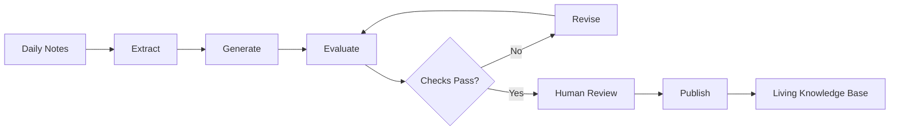

# Geshu Compendium

> A live engineering notebook for turning daily learning, experiments, and project work into tested, reusable knowledge.

**Geshu Compendium** is the knowledge system I am building as I grow into a full-stack AI engineer.

It combines technical notes, project documentation, experiments, build logs, and postmortems in one searchable website. Instead of organizing knowledge only by course or publication date, Geshu organizes it around engineering capabilities: what problem something solves, how to build it, and how it fails in practice.

The longer-term goal is to make Geshu partially self-maintaining through **loop engineering**—iterative generate–evaluate–revise workflows that transform raw daily notes into structured update proposals, verify those changes, and place them into a human review queue before publication.

**Live site:** [angelawurx.github.io/geshu-compendium](https://angelawurx.github.io/geshu-compendium/)
**Status:** In active development

---

## Why Geshu Exists

Modern AI tools can generate code and explanations much faster than one person can manually absorb them. That makes it easy to produce more material while understanding less.

I am building Geshu to create the opposite workflow.

The goal is not to save every output an agent produces. The goal is to preserve the parts I have understood, tested, connected to real projects, and made useful enough to revisit.

Geshu helps me:

* learn by implementing rather than only reading;
* connect coursework to real engineering systems;
* keep a record of experiments, failures, and design decisions;
* turn project work into reusable technical knowledge;
* distinguish provisional ideas from tested engineering patterns;
* use AI as an iterative collaborator without treating its first output as correct.

This repository is therefore both a public notebook and an engineering project of its own.

---

## The Core Workflow

Geshu is designed around a gradual knowledge pipeline:



A raw note may contain something I learned, built, misunderstood, or broke.

The system should eventually be able to:

1. identify the concepts and projects involved;
2. structure the raw material without erasing uncertainty;
3. find related pages already in the knowledge base;
4. propose additions or corrections;
5. validate metadata, links, code, and build output;
6. preserve the source of every proposed change;
7. require review before modifying dependable reference material.

The loop-engineering pipeline is still under development. Geshu does **not** currently allow an AI agent to silently rewrite the public knowledge base.

---

## What Is Inside

### Projects

Complete systems where I apply what I am learning.

Project pages document more than the final interface. They are intended to include:

* the problem and intended user;
* architecture and data flow;
* important implementation decisions;
* experiments and evaluations;
* failure modes and limitations;
* build logs and postmortems;
* related technical notes;
* live demos and source repositories, where available.

Current project areas include AI agents, model implementation, developer tooling, and full-stack applications.

### Field Notes

Reusable explanations of engineering concepts and patterns.

A formal note generally answers:

1. What problem does this solve?
2. What is the right mental model?
3. What is the smallest working implementation?
4. What breaks in a naive implementation?
5. What changes in production?
6. How can the behavior be tested?
7. What tradeoffs affect the design decision?

Notes are organized by engineering capability rather than by the class in which I first encountered the material.

### Labs and Experiments

Small, reproducible investigations.

Examples may include:

* comparing retrieval strategies;
* measuring model latency and cost;
* testing agent retry behavior;
* evaluating structured outputs;
* simulating failure conditions;
* inspecting database or queue behavior;
* reproducing results from papers.

A lab should make it possible to change something, run it again, and observe what happens.

### Build Logs

Dated records of work on real projects.

Build logs retain details that polished project pages usually remove:

* wrong turns;
* failed approaches;
* bugs;
* architectural changes;
* incomplete questions;
* reasons for choosing one implementation over another.

### Postmortems

Structured analysis of failures and incidents.

A postmortem records:

* what happened;
* what was affected;
* how the problem was detected;
* the root cause;
* contributing conditions;
* the resolution;
* preventive changes;
* what I misunderstood before the incident.

### Reference

Selected notes derived from coursework and private learning materials.

These pages provide foundations in areas such as:

* programming;
* data structures and algorithms;
* probability and machine learning;
* graph theory and networks.

Reference material supports the engineering work, but it is not the final purpose of Geshu.

---

## Content Types

Pages use explicit content types so that a short experiment is not presented as though it were a finished guide.

| Type         | Purpose                                                |
| ------------ | ------------------------------------------------------ |
| `concept`    | Explains how something works                           |
| `pattern`    | Solves a recurring engineering problem                 |
| `lab`        | Provides a runnable or reproducible experiment         |
| `build-log`  | Records progress and wrong turns during implementation |
| `postmortem` | Analyzes a failure or incident                         |
| `project`    | Documents a complete system                            |
| `reference`  | Preserves supporting foundational material             |

Pages may also carry a maturity status:

| Status              | Meaning                                                               |
| ------------------- | --------------------------------------------------------------------- |
| `seed`              | Early questions or incomplete thinking                                |
| `working`           | Useful content exists, but it may still change                        |
| `stable`            | Reviewed and accurate enough to rely on                               |
| `production-tested` | Used in a real system with tests, monitoring, or operational evidence |

The status describes the maturity of the page, not the difficulty of its topic.

---

## Repository Structure

```text
geshu-compendium/
├── docs/                   # Published website content
│   ├── index.md            # Homepage
│   ├── projects/           # Project overviews
│   ├── notes/              # Technical and reference notes
│   ├── blog/               # Reading and paper notes
│   └── assets/             # Images and other static assets
│
├── frontend/               # MkDocs theme overrides and visual system
│   └── overrides/
│
├── scripts/                # Content synchronization and validation tools
│   ├── sync_vault.py
│   └── vault_manifest.toml
│
├── .github/workflows/      # Build and deployment automation
├── mkdocs.yml              # Site configuration and navigation
├── requirements.txt        # Python dependencies
└── README.md
```

Private Obsidian vaults and unpublished source materials are not committed to this repository.

---

## Local Development

The site is built with Python and MkDocs.

### 1. Clone the repository

```bash
git clone https://github.com/AngelaWuRX/geshu-compendium.git
cd geshu-compendium
```

### 2. Create a virtual environment

```bash
python3 -m venv .venv
source .venv/bin/activate
```

On Windows:

```powershell
.venv\Scripts\activate
```

### 3. Install dependencies

```bash
pip install -r requirements.txt
```

### 4. Run the local site

```bash
mkdocs serve
```

### 5. Run the strict production build

```bash
mkdocs build --strict
```

The strict build should pass before changes are merged or deployed.

---

## Publishing Notes from the Vault

Selected reference material is generated from private Obsidian notes through the synchronization script.

Check for differences without writing files:

```bash
python3 scripts/sync_vault.py --check
```

Regenerate approved public content:

```bash
python3 scripts/sync_vault.py
```

Run synchronization tests:

```bash
python3 -m pytest scripts/test_sync_vault.py -q
```

Generated pages should not be edited directly. Their source notes or publishing rules should be changed instead, followed by another synchronization run.

Hand-written engineering notes, projects, labs, build logs, and postmortems remain separate from generated reference content.

---

## Privacy and Publication Boundaries

The private vault may contain course materials, personal documents, copyrighted resources, incomplete work, and information that should never become public.

Geshu therefore follows several publication rules:

* private vault directories remain outside version control;
* publication uses explicit allowlists rather than publishing entire folders;
* denied file names and content patterns block synchronization;
* generated pages preserve provenance;
* public builds run validation before deployment;
* private or copyrighted material should never be copied into public notes;
* uncertainty in a source note should not be rewritten as certainty;
* AI-generated changes to canonical notes should require human review.

If you are an instructor, teaching assistant, author, or rights holder and believe something should not be public, please open an issue.

---

## Loop Engineering Roadmap

The current static site and vault publishing pipeline are the foundation for a larger loop-engineering system.

### Available now

* searchable MkDocs website;
* customized light and dark visual system;
* generated navigation;
* selected vault-to-site synchronization;
* strict site builds;
* GitHub Pages deployment;
* project and reference documentation.

### In progress

* clearer separation between projects, labs, logs, and field notes;
* structured page metadata;
* daily-note ingestion;
* backlinks between projects and technical notes;
* content maturity indicators;
* automated changelog generation;
* stronger validation and privacy checks.

### Planned

* concept extraction from daily notes;
* retrieval of related existing pages;
* AI-generated update proposals;
* citation and provenance tracking;
* executable code validation;
* contradiction and duplication detection;
* reviewable pull requests for canonical-note changes;
* stale-note and outdated-runtime detection;
* evaluation reports for every automation run.

The intended workflow is not “ask an agent to improve the website.”

It is:

```text
trigger
→ retrieve relevant context
→ generate a bounded proposal
→ evaluate against explicit checks
→ revise when checks fail
→ stop when evidence is sufficient
→ request human review
```

---

## Design Principles

### Projects are the output

Reference notes are useful, but the purpose of the knowledge base is to support things I actually build.

### Problems come before definitions

A technical note should explain why a concept is needed before presenting terminology.

### Failure modes are part of the explanation

A demo that works once is not yet an engineering pattern.

### Uncertainty should remain visible

The system must not turn “I think this may work” into “this is the correct solution.”

### Generated content needs provenance

Every automated change should be traceable to its source note, experiment, project, or reference.

### Review is a feature

Human review is not a temporary inconvenience to remove. It is part of the system’s reliability model.

### The website should remain useful without an AI assistant

Search, navigation, links, and page structure should work before a chat interface is placed over the content.

---

## Contributing

Geshu is primarily a personal learning and engineering repository, but corrections and thoughtful suggestions are welcome.

Useful contributions include:

* reporting a technical error;
* identifying a broken link or failed example;
* suggesting a clearer explanation;
* pointing out material that should not be public;
* proposing an improvement to the publishing or validation pipeline.

For larger changes, please open an issue before submitting a pull request.

---

## License

Website code is licensed under the [MIT License](LICENSE).

Published notes and written content are licensed under the terms described in [LICENSE-CONTENT](LICENSE-CONTENT).

Unless explicitly stated otherwise, third-party material remains the property of its original authors.
