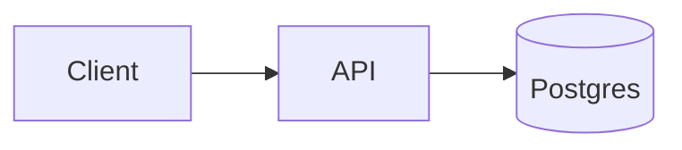

# AI Research Assistant

<!--
A project page is not a screenshot gallery. It is the argument that you can
carry a system from problem to production — so every section below is load
bearing, and `Related notes` is what turns the project from a demo into a
verification of the rest of the site.
-->

## The problem

<!-- Who has it, what it costs them, and why the obvious fix does not work. -->

## System design

<!--
Components and the contract between them. Say what each one owns, and — more
usefully — what it deliberately does not.
-->

## Architecture

## Important decisions

<!--
Three to five, each as: the choice, the alternative you rejected, and the
condition under which you would switch. Decisions without a rejected
alternative are not decisions, they are defaults.
-->

## Evaluation

<!--
How you know it works: the dataset, the metrics, the current numbers, and the
regression gate that stops a change from shipping. "It seemed good in testing"
is the thing this section exists to replace.
-->

## What failed

<!--
The wrong turns, kept on purpose. A project page with no failures reads as
either untested or dishonest, and neither impression helps.
-->

## Live demo and repository

<!-- Link both. If there is no demo, say why — cost, keys, or abuse surface. -->

## Related notes

<!--
Link every note this project exercises. These edges are the point: they prove
the notes are load bearing rather than decorative.
-->
