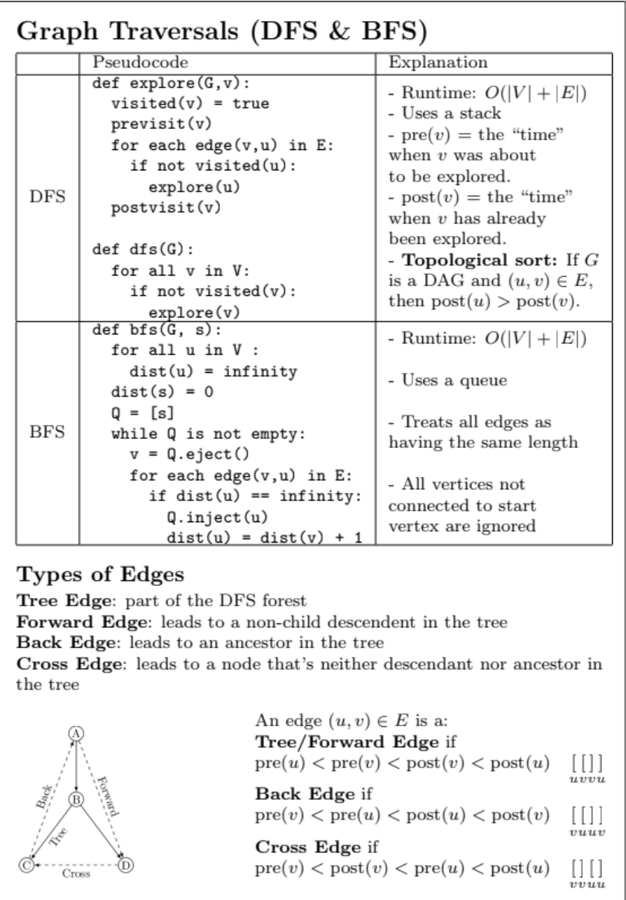
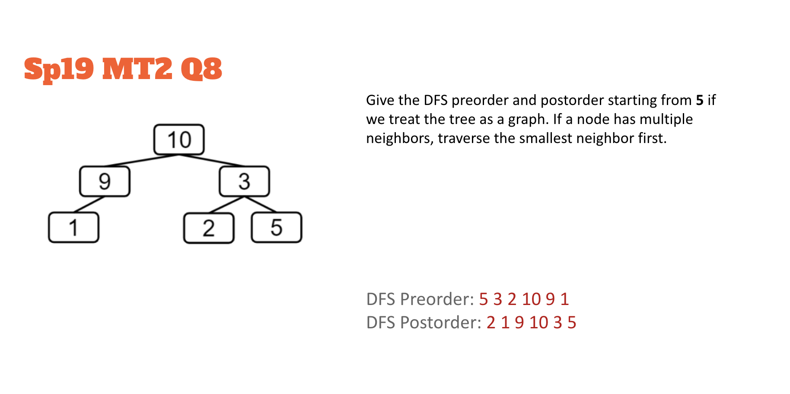
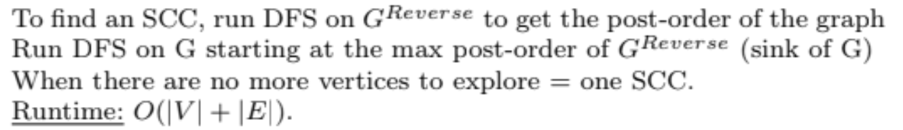

<!-- AUTOGENERATED by scripts/sync_vault.py from "Computer Science copy/Graph Traversal.md". DO NOT EDIT — edit the vault note and re-run: python3 scripts/sync_vault.py -->

# Graph Traversal

## BFS (Breadth-First Search)
- 按距离访问
- Use queue(FIFO), O(|V| + |E|)
	algorithms:
		1. Add G.root to the queue
		2. While queue not empty:
			pop node from the first in the queue and visit;
			add neighbors to the queue if not visited
- [Single-source shortest paths](single-source-shortest-paths.md)
## DFS (Depth-First Search)
- Explore a neighbor's entire subgraph before moving to next neighbor
- Use stack(LIFO), O(|V| + |E|)
- Both pre-order, in-order, post-order are DFS
- algorithm:
	- 1. preorder.add(start)
	- 2. visited.add(start)
	- 3. for each neighbor of start:
		- if neighbor not visited:
			- DFS(neightbor)
	- 4. postorder.add(start)
		

### Topological Sort
[Topological sort](topological-sort.md): a linear ordering of vertices in a DAG
- Use DFS post-order
### Strongly Connected Components (SCC)
- directed, can reach each other like a cycle
- if you condense each SCC, it will for a DAG (use 反证法)
- Use DFS post-order （Kosaraju‘s Algorithm） 
