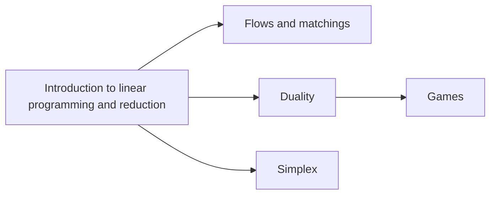

<!-- AUTOGENERATED by scripts/sync_vault.py from "Computer Science copy/cs170/algorithm/optimization/Optimization.md". DO NOT EDIT — edit the vault note and re-run: python3 scripts/sync_vault.py -->

**Related:** Algorithm · [Linear programming](linear-programming.md) · [Reduction](reduction.md)

# Optimization

## 1. Core themes
> Many problems in algorithms are optimization tasks. In such cases, we seek a solution that 1) satisfies certain constraints 2) is the best possible

a) [Linear programming](linear-programming.md): use linear functions to describes a broad class of optimization
b) [Reduction](reduction.md): 

