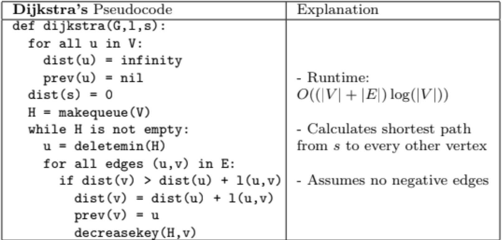

<!-- AUTOGENERATED by scripts/sync_vault.py from "Computer Science copy/Single-source shortest paths.md". DO NOT EDIT — edit the vault note and re-run: python3 scripts/sync_vault.py -->

# Single-source shortest paths

## Dijkstra (works for nonnegative edges)

	Goal： output the shortest path for every source
	Algorithm:
	1. create a priority queue
	2. add source vertex s to PQ with priority 0, add all other sources vertex as unlimited
	3. until the PQ is empty, remove the vertex with the lowest priority from the PQ and relax all of its outgoing edges (update priority of neighboring vertices).
when updating, it follows BFS (uses PQ)

## A* （heuristic）
有方向感、有目标
- heuristic value is given
$f(n) = g(n) + h(n)$
- f(n)是潜力值，g(n) is actual path value you took, h(n) is future heuristic value
- h（F）= 0 means it is the final destination
- h(A) = 9 means at A, you ETA is 9

## Bellman-Ford (handle negative edges)

## DAG shortest path
- visited vertices in topological order
