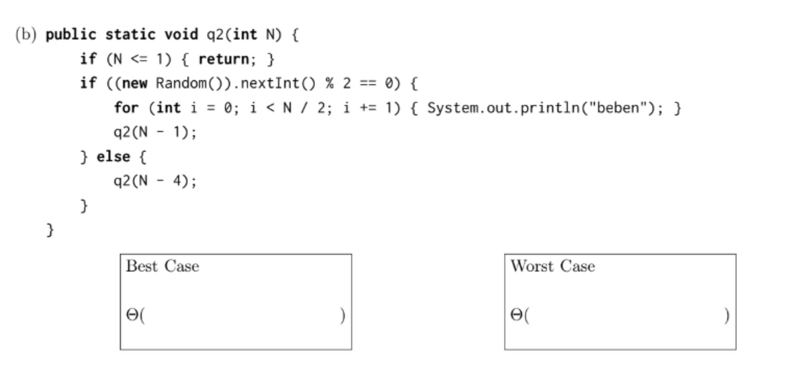

<!-- AUTOGENERATED by scripts/sync_vault.py from "Computer Science copy/cs61b/Asymptotic.md". DO NOT EDIT — edit the vault note and re-run: python3 scripts/sync_vault.py -->

# Asymptotic

General rule: O(1) $\le$ O(N) $\le$ O(N logN) $\le O(N^a)$ $\le O(b^N)$ $\le$ O(N!)

- Always drop constant and lower-order terms
- **Θ**：bounded on both side, equal
- O: Upper bound
- Ω: lower bound
- $$\text{Total Runtime} \approx (\text{Max Work per Level}) \times (\text{Number of Levels})$$

## 常见
### loop
- 第二项不影响runtime
```java
for (int i = 1; i < N; i += 1)
```
O（N）无论第二项如何改变，比如变成（N/2）也是会被视为O（N），除非是（N^2）就是O（N^2）
2.  第三项影响
```java
for (int j = 1; j < N; j *= 2)
```
第三项是乘或除O（logN）

### 减法recursion N-k


==recursion is (N-4) not (N/4) so its N/4 levels== you can just think of each recursion is a level

### 除法recursion
除法里每层工作量衰减太快了，所以只有当每一层的工作量保持不变的时候才是O（NlogN）

| **代码结构**              | **每一层的总工作量**              | **复杂度**           | **例子**                                                                     |
| --------------------- | ------------------------- | ----------------- | -------------------------------------------------------------------------- |
| **单路递归** `q(N/2)`     | **衰减** ($N, N/2, N/4...$) | **$O(N)$**        | $\text{Total} = N + \frac{N}{2} + \frac{N}{4} + \frac{N}{8} + \dots + 1$ |
| **双路递归** `2 * q(N/2)` | **持平** ($N, N, N...$)     | **$O(N \log N)$** | Merge Sort<br>调用两次递归mergeSort（N/2）                                         |
| **无苦力** `q(N/2)`      | **仅递归** ($1, 1, 1...$)    | **$O(\log N)$**   | Binary Search                                                              |
