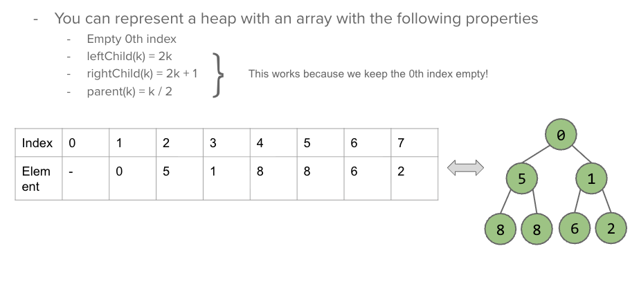
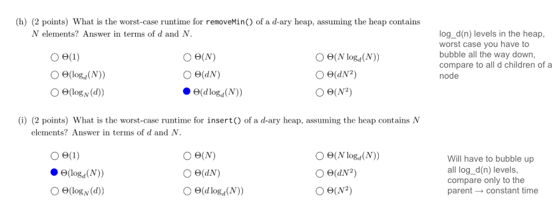

<!-- AUTOGENERATED by scripts/sync_vault.py from "Computer Science copy/cs61b/Heap.md". DO NOT EDIT — edit the vault note and re-run: python3 scripts/sync_vault.py -->

**Related:** [HeapSort](heapsort.md)

# Heap

## Definition
1. Shape property: the tree is complete (filled level by level, left to right)
2. Heap property: 
	1. max-heap: every node $\ge$ its children. Root is max
	2. min-heap
	3. ==没有左小右大这个要求==
3. Array representation following these properties:
	1. Empty 0th index
	2. leftChild(k) = 2k
	3. rightChild(k) = 2k + 1
	4. parent(k) = k/2 
4. Sink: 
	1. min-heap: 找同一层里最小的更换
	2. max-heap: 找更大的更换
## Operations
1. Insertion
	- Insert 0 into the min-heap [-, 1, 2, 3, 4, 5, 7, 8, 6]
	- Put 0 at the end of the heap[-, 1, 2, 3, 4, 5, 7, 8, 6, 0]
	- While inserted node with parent: 
		- If inserted node is smaller, swap 
			- [-, 1, 2, 3, 0, 5, 7, 8, 6, 4]
			- [-, 1, 0, 3, 2, 5, 7, 8, 6, 4]
			- [-, 0, 1, 3, 2, 5, 7, 8, 6, 4]
		- If not, stop 
	- Stop
2. Deletion: 
	- Remove the root node (smallest) from the min-heap [-, 2, 3, 4, 5, 7, 8, 6]
	- Make the last element the new root [-, 6, 2, 3, 4, 5, 7, 8]
	- Sink the node until its in the right place (要找到当前层里最小的孩子，有可能一次就找到了，也有可能要找遍所有)
		- [-, 2, 6, 3, 4, 5, 7, 8]
		- [-, 2, 4, 3, 6, 5, 7, 8]

## Runtime

