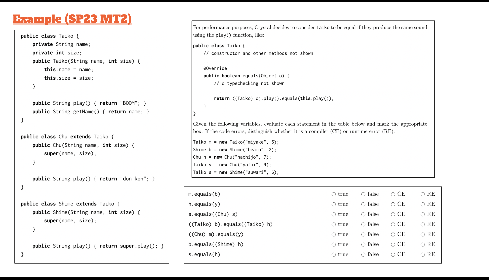

<!-- AUTOGENERATED by scripts/sync_vault.py from "Computer Science copy/cs61b/OOP.md". DO NOT EDIT — edit the vault note and re-run: python3 scripts/sync_vault.py -->

# OOP

> Object-Oriented Programming focusing on Inheritance, Polymorphism and Casting.


### Phase 1: read code
1. The inheritance hierarchy
==inheritance works down, not up==
- Parent: Taiko
- Children: Chu extends Taiko, Shime extends Taiko (Chu and Shime are siblings so not related to each other)
2. play() behavior:
	Taiko: returns "BOOM"
	Chu: returns "don kon"
	Shime: returns super.play() (super is Taiko), returns "BOOM"
3. equals() method
	Usually == check if objects are the exact same instance in memory (reference equality)
	```java 
	public class Taiko {
		public boolean equals(Object o) //Object is an universal class in java. So we need casting here to tell java that o is a Taiko
			return ((Taiko) o).play().equals(this.play()) 
	}
	```

### Phase 2: variables
| **Variable** | **Definition**   | **Static Type (Compiler)** | **Dynamic Type (Runtime)** | **Output of .play()** |
| ------------ | ---------------- | -------------------------- | -------------------------- | --------------------- |
| `m`          | `new Taiko(...)` | `Taiko`                    | `Taiko`                    | "BOOM"                |
| `b`          | `new Shime(...)` | `Shime`                    | `Shime`                    | "BOOM"                |
| `h`          | `new Chu(...)`   | `Chu`                      | `Chu`                      | "don kon"             |
| `y`          | `new Chu(...)`   | `Taiko`                    | `Chu`                      | "don kon"             |
| `s`          | `new Shime(...)` | `Taiko`                    | `Shime`                    | "BOOM"                |

#### ==polymorphism==
- Static Check
- Dynamic/ memory Check: only dynamic type会存在memory里

### Solving problems
