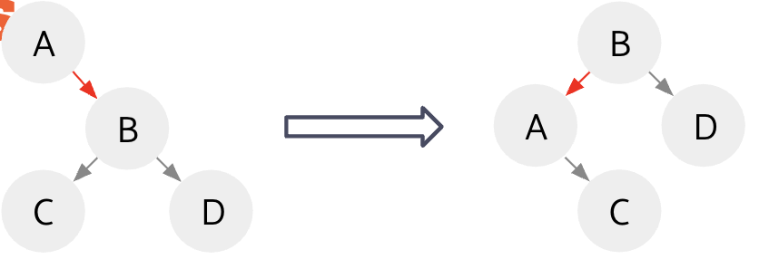
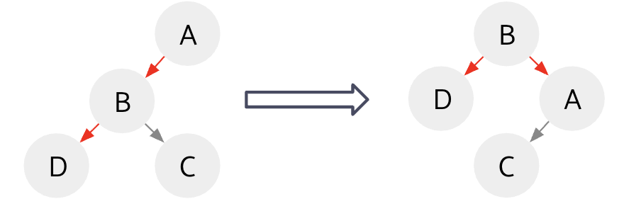
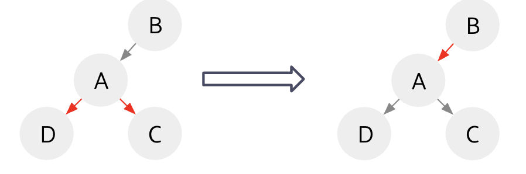

<!-- AUTOGENERATED by scripts/sync_vault.py from "Computer Science copy/Red_Black Trees.md". DO NOT EDIT — edit the vault note and re-run: python3 scripts/sync_vault.py -->

**Related:** [B-Trees](b-trees.md)

# Red Black Trees

## Left Leaning Red Black Trees (LLRB)
> a representation of B-trees that are easier to work with in code

runtime：O（logN）

### B-Trees conversion to LLRB
- A four node: Pick the middle value to be the black parent, and the other two become red children
- A three node: The larger value becomes the Black Parent and the smaller value becomes the Red Left Child
- A two node: become black child, left and right depends on value compared with parent.

### Rotation operations
> When we do insertions, we will break LLRB rules, so we use the following three operations to fix.

1. rotateLeft(A) - fix Red Right Child 
2. rotateRight(A) - fix consecutive red links (left child red AND left-left grandchild red)
	
3. colorFlip(A) - ==fix 2 red children==
> so rotateRight is almost always followed with colorFlip(A)

### Insertion
- Rule：new insertion node is always red and also merge this node temporarily into current node
- 如果操作到最后只剩下最后root的两条边是红的话，也要colorFlip，这样都边黑了
