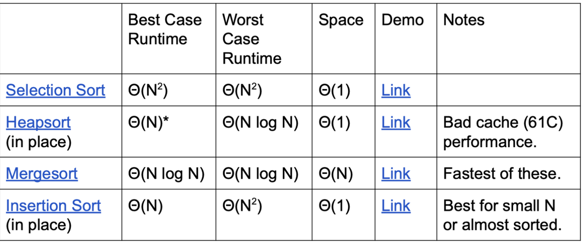

<!-- AUTOGENERATED by scripts/sync_vault.py from "Computer Science copy/cs61b/Sorting and Selecting.md". DO NOT EDIT — edit the vault note and re-run: python3 scripts/sync_vault.py -->

**Related:** [Comparison-based sort](comparison-based-sort.md) · Counting-based sort

# Sorting and Selecting

## Core definitions
- an ordering relation:
	- Law of Trichotomy: One of a << b, a = b, b << a is true.
	- Law of Transitivity: If a << b, and b << c, then a << c.
	- Total order: with the properties above
- sort: permutation of a sequence of elements that puts the keys into non-decreasing order
- ** "the" and "get" are equal in ordering but not equal in .equals()**
- Inversion: 逆序对 given a sequence of elements with Z inversions, perform some sequence of operations to reduce the total number of inversions to zero.
### LSD vs comparison sort
- Comparison sort: Θ(N log N)
- LSD: Θ(WN)
	  - When N huge, W small → LSD wins
	  - When strings very long (W large), N moderate → comparison sort can be faster
## Stability, Adaptiveness and Optimization
- A sort is **stable** if the order of equivalent elements is preserved. 比如同样是3的3个同学，sort前什么顺序sort后什么顺序
- A sort that is **adaptive** exploits the existing order of the array. 
	- Examples are InsertionSort, SmoothSort, and TimSort：
		- Switch to Insertion Sort - When a subproblem reaches size 15 or lower, use insertion sort. It is very very fast for inputs of small sizes.
		- Exploit restrictions on set of keys - For example, if the number of keys is some constant, we can use this constraint to sort faster by applying 3-way QuickSort.
		- Switch from QuickSort - If the recursion goes too deep, switch to a different type of sort.
